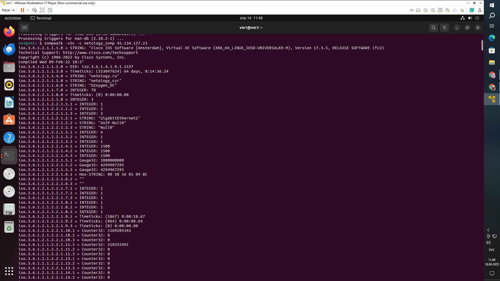
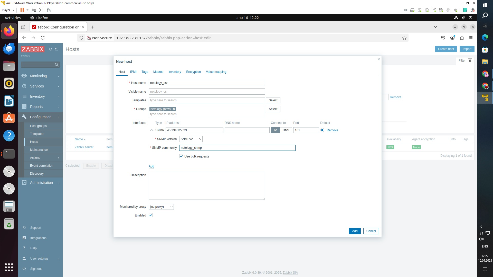
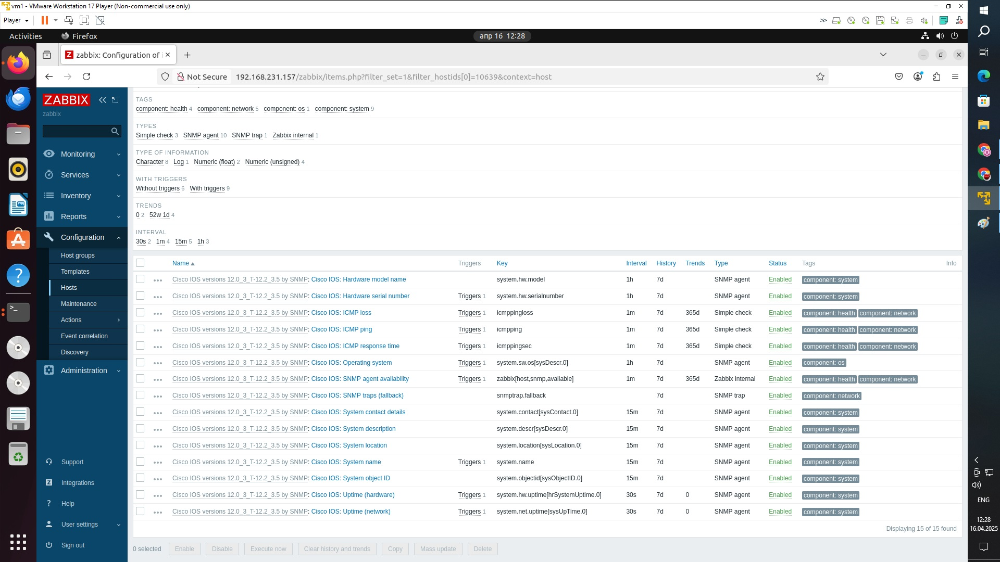
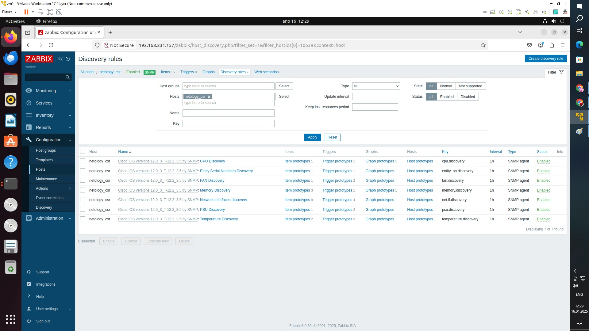
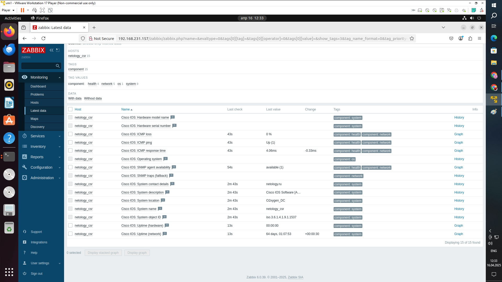

# Домашнее задание к занятию "Мониторинг сетевых устройств. SNMP и SNMP Trap"

Инструменты/ дополнительные материалы, которые пригодятся для выполнения задания
Доступ к виртуальному маршрутизатору Cisco CSR по ssh:
IP: 45.134.127.23
Логин: netology_student
Пароль: iamanetworkengineer!23

# Задание 1
Установите программу iReasoning MIB Browser (или аналогичную) на свой ПК.
С помощью snmpwalk запросите все доступные данные у хоста:
IP: 45.134.127.23
SNMP READ Community: netology_snmp
Решение отправьте в виде скриншота, где будет видна часть полученных данных от опрашиваемого хоста

# ОТВЕТ:

# Задание 2
Установите Zabbix на виртуальную машину.
Инструкция по установке Zabbix (доступно по клику)
Добавьте хост для мониторинга со следующими параметрами:
Имя: netology_csr
Адрес SNMP: 45.134.127.23
SNMP Community: netology_snmp

Прикрепите к хосту встроенный в заббикс шаблон Cisco IOS versions 12.0._3_T-12.2_3.5 by SNMP.

Подождите 2 минуты и перейдите в Latest data по хосту netology_csr.

Решение отправьте в виде скриншота, где будут видны полученные данные от netology_csr

# ОТВЕТ:

